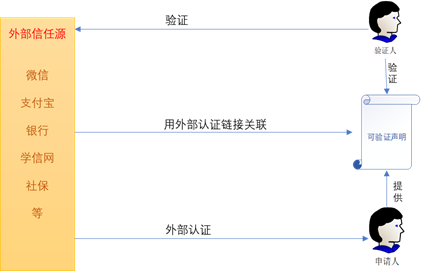
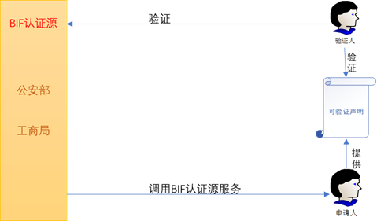
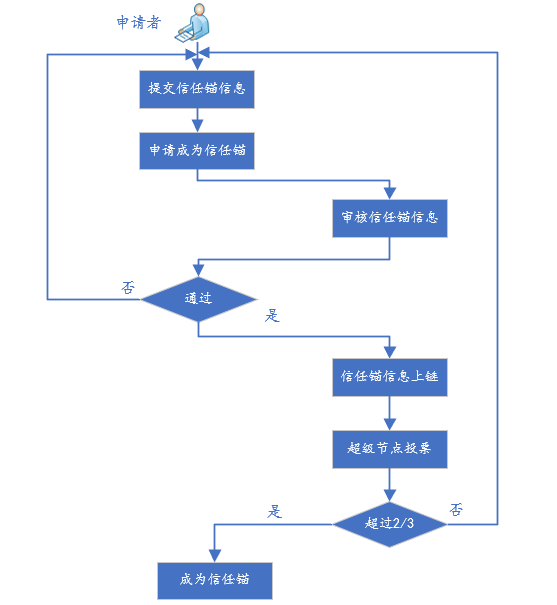

# 1.信任模型
信任模型主要分为中心化和去中心化信任模型，当前版本BIF仅支持中心化的信任模型。

中心化的信任模型，由一个或者一群特定的实体作为信任锚，实体间的信任关系基于信任锚建立。信任锚指定其所信任的实体，被指定的实体指定其信任的其他实体。如此，以一个信任锚为源头，构建起一个信任传递的关系树。树上的每个节点有一条通向信任锚的路径，即为其信任链。任何承认该信任锚的实体在与树中的节点交互时，通过验证其信任链即可判断其是否可信。

目前最成熟、应用最广的PKI体系就是一种中心化信任模型。用户首先向作为信任锚的认证中心申请一个数字证书。认证中心对申请者审查通过后，将其身份信息和公钥写入数字证书，并附加认证中心的数字签名。通过认证中心签发的数字证书即认证用户的身份和公钥的绑定关系，任何人都可以使用认证中心的公钥来验证该证书的真伪，进而使用证书中的公钥验证用户的签名，确认其身份。同时拥有数字证书的用户还可以申请作为下级认证者对其他用户颁发数字证书，其颁发的数字证书的效力最终由认证中心保证。在PKI模型中，任何参与方都必须无条件的信任认证中心，信任关系通过实体间的数字签名从认证中心逐层传递下去。

中心化的信任模型有很多优点，其严谨的信任传递方式、清晰明确的信任与非信任边界在很多场景下都是很好的特性，解决了现实中的很多问题。然而中心化的信任模式也存在一定的缺陷，除了需要无条件的信任锚，对其诚实性及安全性有较高的要求以外，对于现实世界的复杂信任关系，这种依赖于中心节点的模式会严重限制应用的灵活性。

# 2.多源认证协议

多源认证不同于以往的单一身份认证体系，BIF可以为实体提供相应的认证源，除此之外用户还可以在第三方可信任的机构进行身份认证。多源认证协议包括两种模式：

* 外部信任源认证：BIF以自签名可验证声明的形式给BID绑定外部信任源，任何实体都可以通过验证BID绑定的外部信任源来验证实体身份。实体身份认证的可信度由BID绑定的外部信任源公信力决定。

* 内部提供认证源：BIF内部可提供相应的具有公信力的信任机构为实体提供可信认证。

## 2.1 外部信任源认证

外部信任源一般都是具有社会公信力的政府机构、企事业单位或者经过实名认证的其他具有可信力的产品（比如：微信、支付宝、Twitter和Facebook等）。用户使用外部信任源时，需要在BID上面添加一个外部信任源的可验证的证明地址。当验证者需要验证用户身份时首先读取用户信任源，然后从用户提供可信链接去验证，最后验证该用户的身份即可。认证模型如下：

## 2.2  BIF提供的信任源

BIF可以对普通用户和企业两种类型的用户提供身份认证。对于个人提供公安部的接口（需要用户上传名字，身份证号码等信息），进行实名认证。对于公司而言，通过工商局企业查询接口来进行实名身份认证。认证模型如下：

# 3.BIF提供信任源的产生方案

在BIF中信任锚主要分为根信任锚以及扩展信任锚。根信任锚是由超级节点投票产生，本质上来说，根信任锚为中心化信任锚，该信任锚只能由超级节点注册管理。扩展信任锚由用户注册产生。

## 3.1 根信任锚产生

根信任锚必须通过超级节点产生，只有超级节点有资格注册并选举根信任锚，用户在注册成为信任锚时需要抵押一定数量积分，以防止信任锚作恶或者随意退出。具体来说，某一个用户要注册自己为根信任锚，必须先提交申请并填写信任锚相关的资料（该功能在官网实现），然后由超级节点用户审核资料（审核流程再定），如果通过审核，则由超级节点添加该信任锚信息到链上进入候选列表，最后当信任锚获得3分之2的超级节点投票（该选举投票为链下操作，投票结果链上公示），则成为可用的信任锚。具体流程如下：

注意：基础信任锚的申请实体必须为公司或者组织，因此在审核材料的过程中要对实体资质进行审核

## 3.2 扩展信任锚产生

用户可以根据自己提供的服务直接注册成为信任锚，不需要通过选举机制，不过用户在注册成为信任锚时需要抵押一定数量积分，以防止信任锚作恶或者随意退出。

