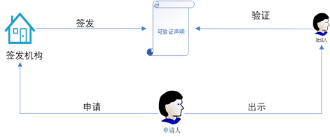
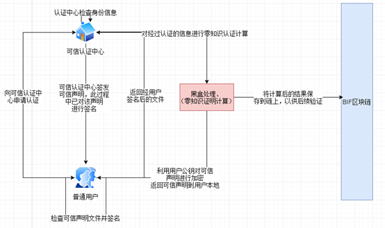
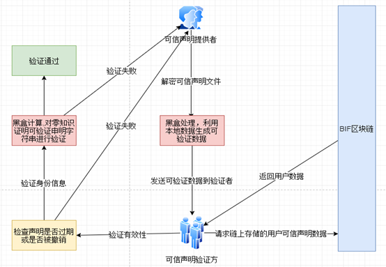

# 1. 可验证声明
可验证声明用来证明实体的某些属性，它可以作为一个数据单元进行存储和传输，并可被任何实体验证。可验证声明主要包括元数据，声明内容以及声明者的签名，其中声明的内容可以为任何数据。在BID里面声明内容为用户身份认证数据的签名。



与可验证声明相关的实体分为三种角色：签发机构、申请人和验证人。可验证声明主要有以下四种操作：

* **签发**：任何大众可信的实体都可以对其他实体的任何属性签发可验证声明，如公安部给个人签发的个人身份认证声明，工商机构给企业签发的企业相关的认证声明

* **存储**：可验证声明可以分为公开声明和隐私声明。公开声明可以存储在BIF公链中；隐私声明通常存储于实体的客户端中由实体自己管理。
* **出示**：可验证声明所有者可以自主决定向谁公开声明，并且声明所有者可以选择出示部分声明内容或者合并出示多张声明的部分内容而不影响对出示声明的验证。
* **验证**：对可验证声明验证不需要与声明签发方进行交互，只需要根据证书签发者的BID在BIF中获取其存储的可验证的字符串，然后对该字符串进行数学运算即可以认证该声明的有效性。

# 2. 可验证声明模板

BIF可信声明基础模板是可信声明中最基础的版本，其他任何信任锚只能在此基础上扩展自己个性化的数据字段，但不可删除模板中的字段。

具体格式如下：

```json
{
    "id":"did:bid:364776fa65a9j86b0387j",
	"@context":"https://example.com/realname/template/v1",
	"content":{
		"IdNumber": "xxxxxxxx",
		"Name": "xxxxxxx",
		},
	"metadata":{
		"issuer":"did:bid:THeNuzzVL5HWartjLpZDZ",
		"subject":"did:bid:DaogpsaKqKMe4nzPy4Aq",
		"iat": 1561983110,//颁发时间戳
   		"exp": 2,//有效期
		"revocation": false
	},
	"signature":[
	     {
			"bid": "did:bid:THeNuzzVL5HWartjLpZDZ",
			"publicKey":"pgp",
			"algorithm":"ECDSAwithSHA256",             
             "value":"AUak5urs4L989dk1im4ACjutojS1EnfqRnuOrUPlyiPG6tCnDunCdDf50RlQr9mtj+YnvTq0yeqIxf72x8PAiRk="
		 },
		 {
			"bid": "did:bid:DaogpsaKqKMe4nzPy4Aq",
			"publicKey":"pgp",
			"algorithm":"ECDSAwithSHA256",
             "value":"AUak5urs4L989dk1im4ACjutojS1EnfqRnuOrUPlyiPG6tCnDunCdDf50RlQr9mtj+YnvTq0yeqIxf72x8PAiRk="
		}
		]
}
```

-  **id** : 该可验证声明的ID,此ID全局唯一，ID根据证书颁发方的bid生成
-  **context **: 每个信任锚必须要将其颁发的声明的模板公示出来，该字段是信任锚公示模板的链接
- **content** : 信任锚为用户颁发的个人身份信息部分，该字段中的内容由信任锚自行定义
- **metadata **: 字段中的每个字段都是必须包含具体字段在模板中
-  **signature **:  前面信息包含信任锚的签名以及用户信息确认后的签名两种

其中**content** 字段内容为用户实际的身份信息，该信息只保存在用户本地或者用户指定的服务器

**matedata** 字段中定义的发证方声明的内容字段解释如下：

- issuer ：证书颁发方的bid标识
- subject ：证书拥有者的bid标识

- iat：证书颁发时间
- exp ： 证书有效期（以年为单位），在BID中证书是具有有效期，当有效期过了之后用户需要重新申请证书
- revocation ：证书是否被撤销，初始值为false，证书颁发机构有权利撤销其颁发的证书，一旦被撤销，证书将无法使用

泰尔英福提供的信任锚颁发的证书格式如下：

```json
{
    "id":"did:bid:364776fa65a9j86b0387j",
	"@context":"https://example.com/realname/template/v1",
	"content":"AUak5urs4L989dk1im4ACjutojS1EnfqRnuOrUPlyiPG6tCnDunCdDf50RlQr9mtj",
	"metadata":{
		"issuer":"did:bid:THeNuzzVL5HWartjLpZDZ",
		"subject":"did:bid:DaogpsaKqKMe4nzPy4Aq",
		"iat": 1561983110,//颁发时间戳
   		"exp": 2,//有效期
		"revocation": false
	},
	"signature":[
	     {
			"bid": "did:bid:THeNuzzVL5HWartjLpZDZ",
			"publicKey":"pgp",
			"algorithm":"ECDSAwithSHA256",             
             "value":"AUak5urs4L989dk1im4ACjutojS1EnfqRnuOrUPlyiPG6tCnDunCdDf50RlQr9mtj+YnvTq0yeqIxf72x8PAiRk="
		 },
		 {
			"bid": "did:bid:DaogpsaKqKMe4nzPy4Aq",
			"publicKey":"pgp",
			"algorithm":"ECDSAwithSHA256",
             "value":"AUak5urs4L989dk1im4ACjutojS1EnfqRnuOrUPlyiPG6tCnDunCdDf50RlQr9mtj+YnvTq0yeqIxf72x8PAiRk="
		}
		]
}
```

其中content字段为用户真实信息的加密值，在泰尔英福提供的信任锚中该字段被信任锚使用用户的公钥加密了，只有用户本身或者拥有私钥的人才能加密该信息，在一定意义上也保护了用户的隐私数据安全。

# 3. 证书管理流程

## 3.1 证书申请
证书申请是指用户从信任锚处申请为自己颁发一个身份证书文件，信任锚对该用户提供的一些数据进行验证，如果验证通过则为该用户颁发证明文件并同时将该文件进行加密处理并将处理后的结果保存在链上。

下面以公安身份认证接口为信任锚颁发证明文件为例介绍信任锚颁发证明文件的过程

根据上面可信声明基础模板定义的公安身份接口模板如下：



颁发流程描述：

-  用户进行活体检测，并根据活体检测结果抽取几张照片
-  用户输入姓名，身份证号点击确认，然后进入等待状态
-  可信认证中心及信任锚拿到用户的信息后，调用公安身份认证接口查询用户的身份证信息，拿到身份信息以及身份证照片
-  利用图像识别技术检验上传的照片与身份照片的匹配度，根据匹配结果判断是否为用户本人在操作，如果不是直接返回失败信息
-  用户身份信息验证通过后，认证中心颁发可信声明并且对申明进行签名并返回给用户
-  用户拿到可信身份后确认声明信息后，对声明进行签名并将前后的结果返回给认证中心，同时用户调用链接口将该证书信息ID等信息更新到DDO文档中
-  认证中心拿到确认后的申明后验证签名，并对确认后申明中的重要信息放入黑盒计算产生可验证的字符串
-  拿到字符串后，信任中心发起交易将可信身份链上存储部分上链
-  根据交易hash等信息获取可信身份链上存储位置，组装最终需要返回给用户的声明信息
-  可信身份组装完毕后利用用户的公钥对可信声明进行签名并将最终的结果返回给用户保存

## 3.2 证书出示

####  可验证出示

可验证出示是指用户不需要出示任何详细信息只需要提供hash值或者一些可验证字符串但不包含个人隐私数据的值给验证，验证方拿到这个数据后可以验证你是你即可。

####  详情出示

详情出示是指要出示用户详细信息的验证方式，流程如下：

* 用户输入密码或者人脸解密keystore文件获得私钥

- 利用私钥解密证书中的详细信息
-  将详细以及可验证字符串等信息制作出示二维码

## 3.3     证书验证

BID身份认证是指验证者对信任锚颁发的可信声明证书的认证，例如：链上的某个用户表示他是做过实名认证的，证书是由公安颁发的，那么验证方将对用户拥有的证书进行验证，看起说的是否为真实。该验证过程中不涉及透漏任何个人隐私，与传统认证不同的是该认证过程中完全不需要和信任锚发生任何的交互即可完成认证。具体过程如下：



详细步骤：

-  身份的提供方首先解密保存在本地的可信声明文件
-  将可信声明文件放入黑盒中处理，产生可验证的字符串，并将该字符串发生给验证法
-  验证方拿到字符串后根据其提供的可信声明的ID查询存储在链上的声明文件
-  验证方拿到数据后首先验证该声明的有效性，如果该声明已被撤销或者已过期，则返回验证失败结果到提供方
-  验证方根据链上存储信息以及提供方提供的信息进行密码学计算，如果验证通过则表示身份认证成功，验证通过

## 3.4 证书撤销

证书吊销是指证书所有者因为一些违规以及其他操作，导致证书被信任锚吊销了，一旦证书被吊销，用户则没法使用该证书